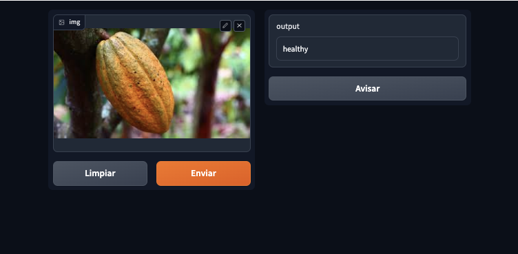
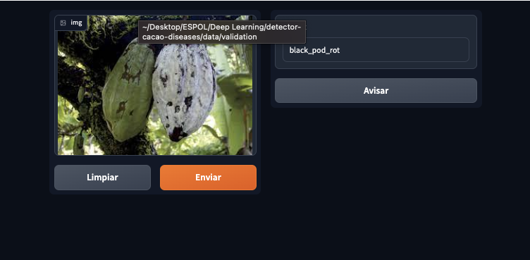

# CNN with PyTorch - Detector of deaseases in cacao
This project show how to implement a Convolutional Neural Network (CNN)using Pytorch **to detect deseases in cocoa crops** from **images**. 
The main idea is create a Neural Network capable to clasify an image in one of the following classes: black_por_rot, monilia or healthy.

**So, here’s a simple pytorch template that help you get into your main project faster and just focus on your core (Model Architecture, Training Flow, etc)**


# Requirements
- [Numpy](https://numpy.org/) (The fundamental package for scientific computing with Python
)
- [PyTorch](https://pytorch.org/) (An open source deep learning platform) 
- [Matplotlib](https://matplotlib.org/) (library for creating static, animated, and interactive visualizations)

# Interface
- Detecting healthy cocoa crops



- Detecting deaseas


# Model


In a nutshell here's how to use this template, so **for example** assume you want to implement ResNet-18 to train mnist, so you should do the following:
- In `modeling`  folder create a python file named whatever you like, here we named it `example_model.py` . In `modeling/__init__.py` file, you can build a function named `build_model` to call your model

```python
import torch.nn as nn
import torch.optim as optim
from torch.utils.data import DataLoader
train_size = 0.8
val_size = 0.1
test_size = 0.1
split_data(black_pod_rot_SRC_DIR,
           TRAINING_BPR_DIR,
           VALIDATION_BPR_DIR,
           TEST_BPR_DIR,
           split_ratio=(train_size,val_size, test_size))
``` 

   
- In `engine`  folder create a model trainer function and inference function. In trainer function, you need to write the logic of the training process, you can use some third-party library to decrease the repeated stuff.

```python
# transformer
image_transforms = transforms.Compose([
    transforms.Resize((width, height)),
    transforms.ToTensor(),
])

# upload
train_dataset = ImageFolder(train_data_dir, transform=image_transforms)
train_loader = DataLoader(train_dataset, batch_size=32, shuffle=True)
```

- In `tools`  folder, you create the `train.py` .  In this file, you need to get the instances of the following objects "Model",  "DataLoader”, “Optimizer”, and config
```python
#Definir el modelo
class CustomModel(nn.Module):
    def __init__(self):
        super(CustomModel, self).__init__()
        super(CustomModel, self).__init__()
        self.conv1 = nn.Conv2d(3, 32, kernel_size=3, padding=1)
        self.bn1 = nn.BatchNorm2d(32)
        self.pool1 = nn.MaxPool2d(kernel_size=2, stride=2)

        self.conv2 = nn.Conv2d(32, 64, kernel_size=3, padding=1)
        self.bn2 = nn.BatchNorm2d(64)
        self.pool2 = nn.MaxPool2d(kernel_size=2, stride=2)

        self.conv3 = nn.Conv2d(64, 128, kernel_size=3, padding=1)
        self.bn3 = nn.BatchNorm2d(128)
        self.pool3 = nn.MaxPool2d(kernel_size=2, stride=2)


        self.relu = nn.ReLU()

        # Obtén el tamaño de salida de las capas convolucionales y pooling
        x = torch.randn(1, 3, height, width)
        self._to_linear = None
        self.convs(x)

        self.fc1 = nn.Linear(self._to_linear, 128) 
        self.dropout1 = nn.Dropout(p=dropout_p) 
        self.fc2 = nn.Linear(128, 3)
        self.dropout2 = nn.Dropout(p=dropout_p)

    def convs(self, x):
        # Pasada a través de las capas convolucionales y pooling
        x = self.pool1(self.bn1(self.relu(self.conv1(x))))
        x = self.pool2(self.bn2(self.relu(self.conv2(x))))
        x = self.pool3(self.bn3(self.relu(self.conv3(x))))

        if self._to_linear is None:
            self._to_linear = x[0].shape[0]*x[0].shape[1]*x[0].shape[2]
        return x

    def forward(self, x):
        x = self.convs(x)
        x = x.view(-1, self._to_linear)  # aplanar el tensor
        x = self.relu(self.fc1(x))
        x = self.dropout1(x)
        x = self.fc2(x)
        x = self.dropout2(x)
        return x


# Instanciar el modelo
model = CustomModel()
```

- Pass the all these objects to the function `do_train` , and start your training
```python
# Entrenamiento del modelo
num_epochs = 10
for epoch in range(num_epochs):
    for images, labels in train_loader:
        optimizer.zero_grad()
        outputs = model(images)
        loss = criterion(outputs, labels)
        loss.backward()
        optimizer.step()

    print(f"Epoch [{epoch+1}/{num_epochs}], Loss: {loss.item()}")

# Guardar el modelo
torch.save(model.state_dict(), "model.pth")
```

**You will find a template file and a simple example in the model and trainer folder that shows you how to try your first model simply.**


# In Details
```
├──  tools
│    └── helper.py  - Utility for testing, visualizing in the contet of deep learning.
│
│
├──  configs  
│    └── train_mnist_softmax.yml  - here's the specific config file for specific model or dataset.
│ 
│
├──  data  
│    └── healthhy  - here's the datasets folder that is responsible for all data handling.
│    └── black_pod_rol  - here's the data preprocess folder that is responsible for all data augmentation.
│    └── pod_borer   - here's the file to make dataloader.
│    └── othedeseas   - here's the file that is responsible for merges a list of samples to form a mini-batch.
│
│
├──  dataset
│   ├── training     - this file contains the train loops.
│   └── test   - this file contains the inference process.
    └── validation   - this file contains the inference process.
│
│
├── layers              - this folder contains any customed layers of your project.
│   └── conv_layer.py
│
│
├── modeling            - this folder contains any model of your project.
│   └── example_model.py
│ 
│ 
└── tests					- this foler contains unit test of your project.
     ├── test_data_sampler.py
```


# Authors
<div style="display: flex; ">
<a title="Diego Zambrano" href="https://github.com/dizamfi">

</a>


<a title="Johan Gilces Reyes" href="https://github.com/jjgilces">

</a>

<a title="Erwin Medina" href="https://github.com/Erwing23">

</a>

<a title="Axcel Espinoza" href="https://github.com/eapb99">

</a>
</div>


